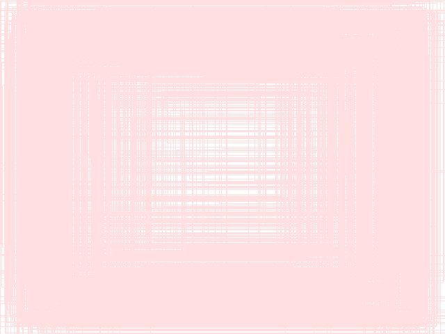
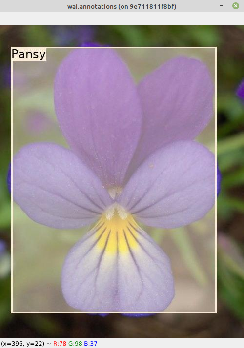

# Combine annotations in single image

In order to determine whether a model does not have a bias regarding 
to the location of annotations when training, the `to-annotation-overlay-od` 
plugin can generate a single image that shows the outlines of all the annotations 
(bbox or polygon). If images have different sizes (e.g., from different 
data collection batches), scaling the images and annotations to a specific 
size, like the one a model uses internally is, recommended. The following
example overlays all the bboxes from the [17flowers]() 
object detection dataset on a single image of 640x480 pixels:

```bash
wai-annotations convert \
  from-voc-od \
    -i "./17flowers-voc/voc/*.xml" \
  to-annotation-overlay-od \
    -c 255,0,0,32 \
    -s 640,480 \
    -o ./to-annotation-overlay-od.png
```




# Overlay annotations and display them

The following loads an object detection dataset, overlays the 
annotations and displays them in a window:

```bash
wai-annotations convert \
  from-voc-od \
    -i "./17flowers-voc/voc/*.xml" \
  add-annotation-overlay-od \
    --vary-colors \
    --outline-alpha 255 \
    --outline-thickness 3 \
    --fill \
    --fill-alpha 128 \
    --font-size 24 \
    --text-placement T,L \
    --force-bbox \
  image-viewer-od \
    --size 1024,768 \
    --position 300,150 \
    --delay 200    
```


