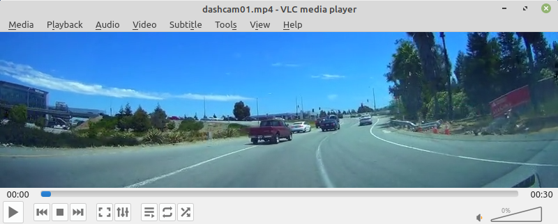
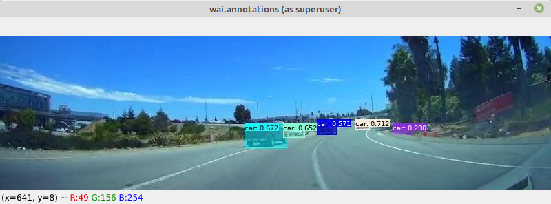

[Redis](https://redis.io/) is a fast, in-memory data store, which can be used
as a database, cache, streaming engine, and message broker. It is a great way
of incorporating deep learning frameworks that are run from within 
[Docker](https://www.data-mining.co.nz/docker-for-data-scientists/) containers,
simplifying the dependencies due to decoupling. 

wai.annotations has support for the following data domains:

* **image classification**: sends image, receives JSON with label/probability pairs
* **object detection**: sends image, receives JSON in [OPEX](https://github.com/WaikatoLink2020/objdet-predictions-exchange-format) format
* **image segmentation**: sends image, receives segmented image (indexed PNG or blue-channel PNG)

# Docker images

The following Docker images are available for connecting to the prediction plugins:

* Image classification

    * [PyTorch](https://github.com/waikato-datamining/pytorch/tree/master/image-classification)
    * [Tensorflow](https://github.com/waikato-datamining/tensorflow/tree/master/image_classification)

* Object detection

    * [Detectron2](https://github.com/waikato-datamining/pytorch/tree/master/detectron2)  
    * [Yolov5](https://github.com/waikato-datamining/pytorch/tree/master/yolov5)
    
* Image segmentation

    * [Image segmentation Keras](https://github.com/waikato-datamining/tensorflow/tree/master/image-segmentation-keras)


# Object detection example

In this example we are using a prebuilt yolov5 model (using MS-COCO) to make predictions on the
frames that come from a dashcam video, overlay the predictions on the images and display them.
For the model and wai.annotations we will be using existing docker containers.

**NB:** No GPU required.

## Data

### Input



### Output



## Preparation

NB: Place all the downloads in the current directory

* Download the [dashcam01.mp4](https://github.com/lessthanoptimal/BoofCV-Data/blob/master/example/tracking/dashcam01.mp4)) video from the BoofCV project
* Download the [yolo5n.pt](https://github.com/ultralytics/yolov5/releases/download/v6.0/yolov5n.pt) model
* Download the [coco.yaml](https://github.com/ultralytics/yolov5/blob/956be8e642b5c10af4a1533e09084ca32ff4f21f/data/coco.yaml) data description for the yolo5n model
* The host machine must have a Redis server instance running. Two options:

    1. Install it natively via `sudo apt-get install redis` (and then restart it with `sudo systemctl restart redis`)
    2. Spin up a docker container with: `docker run --net=host --name redis-server -d redis`
  

## Yolov5 model

The following command launches a Yolov5 model via the container's `yolov5_predict_redis` command,
running on the CPU: 

```bash
docker run \
    --net=host -u $(id -u):$(id -g) \
    -v `pwd`:/workspace \
    -it waikatodatamining/pytorch-yolov5:2022-01-21_cpu \
  yolov5_predict_redis \
    --redis_in images \
    --redis_out predictions \
    --model /workspace/yolov5n.pt \
    --data /workspace/coco.yaml
```

## wai.annotations

The following wai.annotations pipeline loads every 2nd frame from the dashcam01.mp4 video,
obtains predictions from the Yolov5 model (using the Redis backend), overlays the predictions
and then displays them:

```bash
docker run -u $(id -u):$(id -g) \
    --net=host \
    --env="DISPLAY" --volume="/tmp/.X11-unix:/tmp/.X11-unix:rw" \
    -v `pwd`:/workspace \
    -it waikatoufdl/wai.annotations:0.7.6 \
  wai-annotations convert \
    from-video-file-od \
      -i /workspace/dashcam01.mp4 \
      -n 2 \
    redis-predict-od \
      --channel-out images \
      --channel-in predictions \
      --timeout 1.0 \
    add-annotation-overlay-od \
      --outline-alpha 255 \
      --outline-thickness 1 \
      --fill \
      --fill-alpha 128 \
      --vary-colors \
      --font-size 10 \
      --text-format "{label}: {score}" \
      --text-placement T,L \
      --force-bbox \
    image-viewer-od \
      --size 800,224 \
      --delay 1
```
